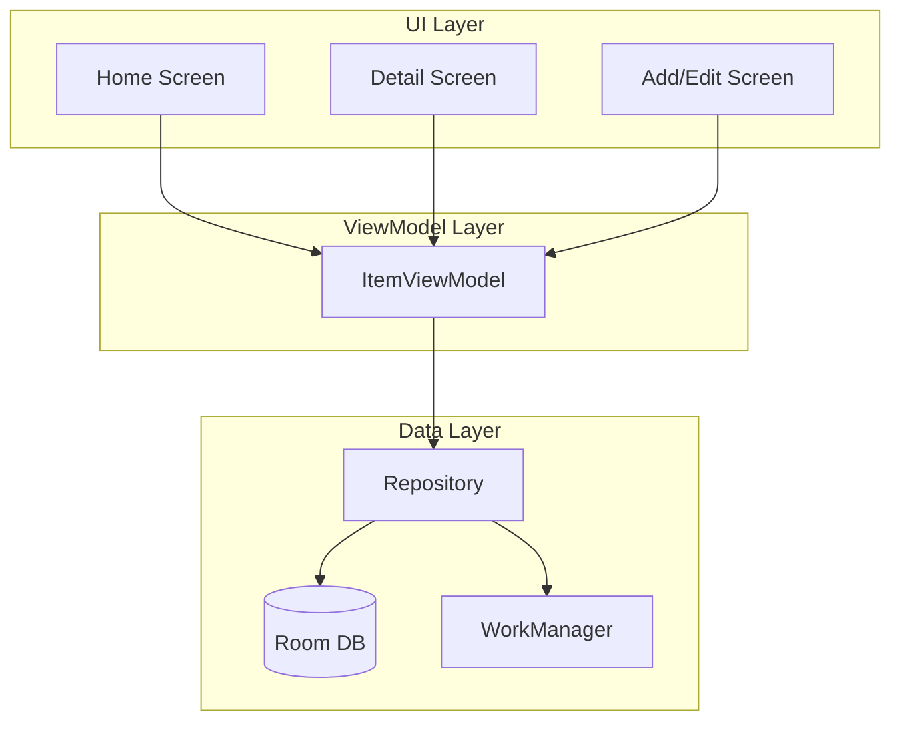

# Receipt & Warranty Android App Plan

## Tech Stack

- **Language**: Kotlin
- **UI**: Jetpack Compose with Material Design 3
- **Database**: Room
- **Image Storage**: Local app storage (files) with URI references in DB
- **Reminders**: WorkManager for scheduled notifications
- **Min SDK**: 34 (Android 14)

---

## Architecture Overview




---

## Data Model

**Entity: `ReceiptWarranty**`


| Field              | Type    | Purpose                         |
| ------------------ | ------- | ------------------------------- |
| id                 | Long    | Primary key                     |
| title              | String  | User-defined title              |
| company            | String  | Company/brand name (for search) |
| receiptImageUri    | String? | Path/URI to receipt photo       |
| warrantyImageUri   | String? | Path/URI to warranty card photo |
| purchaseDate       | Long?   | Purchase date (epoch)           |
| warrantyExpiryDate | Long?   | Warranty expiry (epoch)         |
| notes              | String? | Optional notes                  |
| createdAt          | Long    | Timestamp                       |


---

## Project Structure

```
app/
├── src/main/
│   ├── java/com/yourapp/receiptwarranty/
│   │   ├── MainActivity.kt
│   │   ├── ReceiptWarrantyApp.kt
│   │   ├── data/
│   │   │   ├── ReceiptWarranty.kt (entity)
│   │   │   ├── ReceiptWarrantyDao.kt
│   │   │   ├── AppDatabase.kt
│   │   │   └── ReceiptWarrantyRepository.kt
│   │   ├── ui/
│   │   │   ├── theme/ (Material 3 theme)
│   │   │   ├── screens/
│   │   │   │   ├── HomeScreen.kt
│   │   │   │   ├── AddEditScreen.kt
│   │   │   │   └── DetailScreen.kt
│   │   │   └── components/ (SearchBar, ItemCard, etc.)
│   │   ├── viewmodel/
│   │   │   └── ReceiptWarrantyViewModel.kt
│   │   └── workers/
│   │       └── WarrantyReminderWorker.kt
│   └── res/
│       └── values/ (strings, themes)
```

---

## Core Screens

### 1. Home Screen (List + Search)

- **Search bar** at top: filter by title, company, or both
- **Recyclable list** of cards (Compose `LazyVerticalGrid` or `LazyColumn`)
- Each card shows: thumbnail, title, company, warranty status (expiring soon / expired / no warranty)
- **FAB** to add new item
- **Filter chips**: All | Expiring Soon | Expired
- Empty state when no items

### 2. Add/Edit Screen

- Title input
- Company input (with autocomplete/suggestions from existing companies)
- Receipt photo: camera or gallery picker
- Warranty photo: camera or gallery picker
- Purchase date picker
- Warranty expiry date picker
- Notes (optional)
- Save / Cancel buttons

### 3. Detail Screen

- Full-size receipt and warranty images (if any)
- All metadata displayed
- Edit and Delete buttons
- Warranty countdown badge

---

## Search Implementation

- **Live search**: As user types in search bar, filter `Flow` in ViewModel
- **Search fields**: `title`, `company` (case-insensitive `contains`)
- Use Room `@Query` with `LIKE` or filter in Kotlin via `Flow.map`
- Debounce search input (~300ms) for performance

---

## Warranty Reminder System

1. **WorkManager** schedules a one-time `WarrantyReminderWorker` per item when warranty expiry is set
2. **Worker** runs ~7 days before expiry; shows notification via NotificationManager
3. **Notification**: "Warranty for [title] expires in 7 days. Renew now?"
4. When user edits or deletes item, cancel the corresponding WorkManager request
5. Use `setExpedited()` for timely delivery on Android 12+

---

## Image Handling

- Store images in `getExternalFilesDir(Environment.DIRECTORY_PICTURES)` or app-specific storage
- Use `MediaStore` or `ActivityResultContracts.TakePicture` / `GetContent` for camera/gallery
- Save file path or `content://` URI in database
- Load with `Coil` or `Glide` in Compose (`AsyncImage`)

---

## UI Design (Clean & Modern)

- **Material 3** components: `SearchBar`, `Card`, `FAB`, `TextField`, `DatePicker`
- **Color scheme**: Primary accent (e.g., teal or blue), neutral backgrounds
- **Typography**: `Roboto` or `Google Sans` via Material 3
- **Spacing**: Consistent 16dp/24dp padding
- **Cards**: Elevated cards with rounded corners, image thumbnail on left, text on right
- **Expiry badges**: Color-coded (green = valid, amber = expiring soon, red = expired)

---

## Dependencies (build.gradle.kts)

```kotlin
// Compose
implementation("androidx.compose.material3:material3")
implementation("androidx.compose.material:material-icons-extended")

// Room
implementation("androidx.room:room-runtime")
implementation("androidx.room:room-ktx")
ksp("androidx.room:room-compiler")

// WorkManager
implementation("androidx.work:work-runtime-ktx")

// Coil for images
implementation("io.coil-kt:coil-compose")

// Navigation
implementation("androidx.navigation:navigation-compose")

// ViewModel
implementation("androidx.lifecycle:lifecycle-viewmodel-compose")
```

---

## Permissions

- `READ_MEDIA_IMAGES` / `READ_EXTERNAL_STORAGE` (API 33+): for gallery
- `CAMERA`: for taking photos
- `POST_NOTIFICATIONS` (API 33+): for expiry reminders

---

## Implementation Order

1. **Project setup**: Create Android project with Compose, add dependencies
2. **Data layer**: Entity, DAO, Database, Repository
3. **Add/Edit screen**: Form UI, image pickers, date pickers, save logic
4. **Home screen**: List, search bar, filter chips, navigation to detail
5. **Detail screen**: Full view, edit/delete
6. **Search**: Wire search bar to filtered list
7. **Warranty reminders**: WorkManager worker, scheduling on add/edit
8. ** polish**: Empty states, animations, error handling

