# PROJECT REPORT

## CHAPTER 1: INTRODUCTION

### 1.1 Background
Receipt and warranty documents are commonly stored in paper form or scattered across gallery apps, email threads, and cloud folders. This makes it difficult to find proof of purchase quickly, track warranty expiration, and maintain records across devices.

The current project, **Receipt & Warranty**, is an Android application built with Kotlin and Jetpack Compose. It combines local storage (Room) with cloud sync (Firebase Firestore) and Google Sign-In, so users can maintain a reliable personal archive of receipts and warranties.

### 1.2 Objective
1. Build a mobile-first system for storing and managing receipts and warranties.
2. Provide secure user authentication through Google Sign-In.
3. Support offline-first usage with local database persistence.
4. Synchronize user data with cloud storage for cross-device continuity.
5. Send reminder notifications before warranty expiry.
6. Support structured search, filtering, and category-based organization.

### 1.3 Purpose and Scope

#### 1.3.1 Purpose
The purpose of the system is to reduce loss of purchase records, improve warranty tracking, and provide a single trusted place for users to manage post-purchase documentation.

#### 1.3.2 Scope
The current implementation scope includes:
1. Android application (`minSdk 34`, `targetSdk 35`).
2. Google authentication and user session handling.
3. Receipt/Warranty CRUD operations with images and notes.
4. Local storage using Room database.
5. Cloud sync with Firestore and image handling via Google Drive API.
6. Reminder scheduling using WorkManager.
7. CSV export and dashboard statistics.

Out-of-scope for this repository:
1. Dedicated custom backend service (no separate backend server code in this repo).
2. Web portal/admin panel.

---

## CHAPTER 2: SURVEY OF TECHNOLOGY

### 2.1 Justification of Selection of Technology
The selected stack prioritizes Android-native performance, maintainability, and cloud integration speed.

#### 2.1.1 Front End
1. **Kotlin**: modern, concise, null-safe language for Android.
2. **Jetpack Compose**: declarative UI with faster iteration and cleaner state handling.
3. **Material 3**: consistent, modern UI components.
4. **Navigation Compose**: route-driven screen transitions.

#### 2.1.2 Back End
1. **Firebase Authentication**: secure sign-in with minimal backend setup.
2. **Cloud Firestore**: scalable document database for user-scoped data.
3. **Google Drive API**: cloud image storage workflow tied to user account.
4. **BaaS model**: backend capabilities without maintaining custom server infrastructure.

---

## CHAPTER 3: REQUIREMENT AND ANALYSIS

### 3.1 Existing System
In common manual or fragmented digital approaches:
1. Receipts are stored physically and often lost/faded.
2. Warranty expiry is tracked manually or not tracked at all.
3. No unified searchable catalog exists.
4. Cross-device continuity is poor.

### 3.2 Proposed System
The proposed system is an Android app with:
1. Structured receipt/warranty records.
2. Local-first persistence using Room.
3. Cloud sync through Firestore.
4. Google account-based access and personalization.
5. Reminder notifications and dashboard insights.

### 3.3 Requirement Analysis

#### Functional Requirements
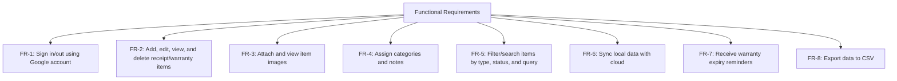

#### Non-Functional Requirements
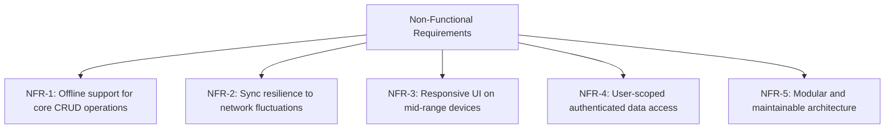

### 3.4 Planning and Scheduling
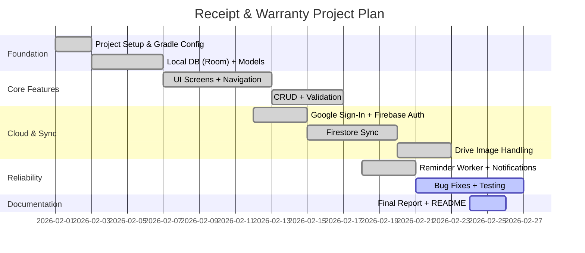

### 3.5 Hardware Requirements

#### Development Machine
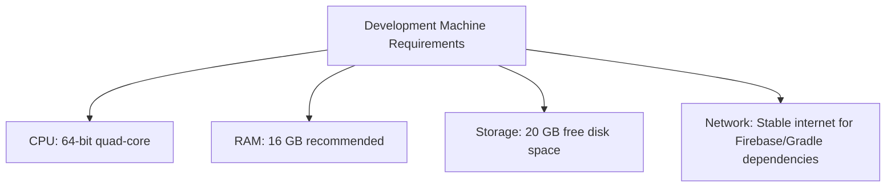

#### Target Device
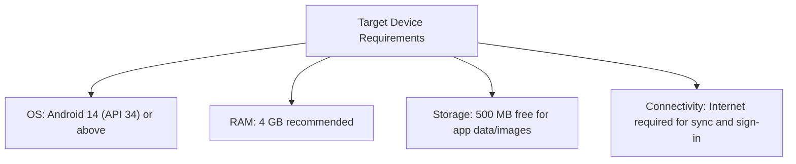

### 3.6 Software Requirements
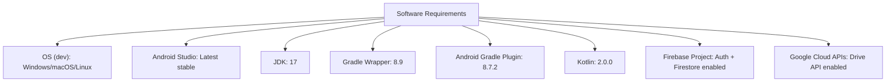

---

## CHAPTER 4: SYSTEM DESIGN

### 4.1 Tree View
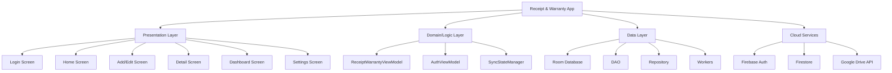

### 4.2 Module Division
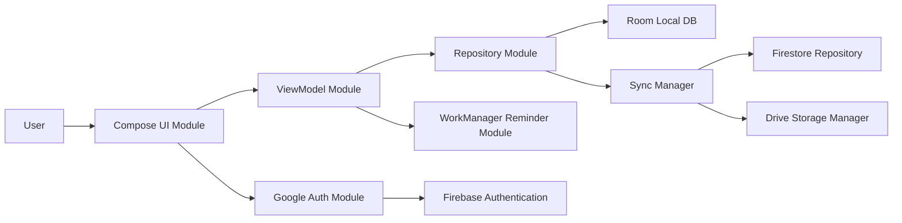

### 4.3 Data Dictionary

#### Local Entity: `receipt_warranty`
```mermaid
flowchart TD
    RW["Entity: receipt_warranty"]
    RW --> RW1["id: Long (PK)<br/>Local unique ID"]
    RW --> RW2["type: Enum RECEIPT/WARRANTY<br/>Item type"]
    RW --> RW3["title: String<br/>Item title"]
    RW --> RW4["company: String<br/>Store/company name"]
    RW --> RW5["category: String?<br/>User category"]
    RW --> RW6["imageUri: String?<br/>Local/cloud image URI"]
    RW --> RW7["driveFileId: String?<br/>Google Drive file ID"]
    RW --> RW8["cloudId: String?<br/>Firestore document ID"]
    RW --> RW9["purchaseDate: Long?<br/>Purchase timestamp"]
    RW --> RW10["warrantyExpiryDate: Long?<br/>Expiry timestamp"]
    RW --> RW11["reminderDays: Enum?<br/>Reminder offset"]
    RW --> RW12["notes: String?<br/>Additional notes"]
    RW --> RW13["createdAt: Long<br/>Creation time"]
    RW --> RW14["updatedAt: Long<br/>Last update time"]
```

#### Local Entity: `deleted_items`
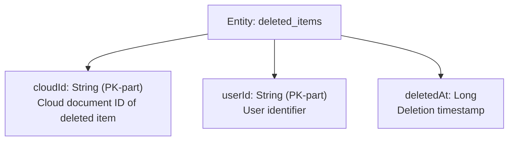

#### Cloud Collections (Firestore)
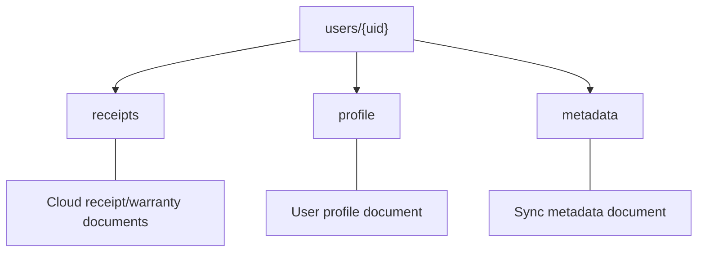

### 4.4 ER Diagrams
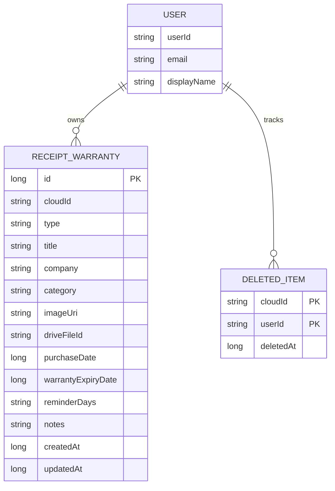

### 4.5 DFD/UML Diagrams

#### DFD (Level 0)
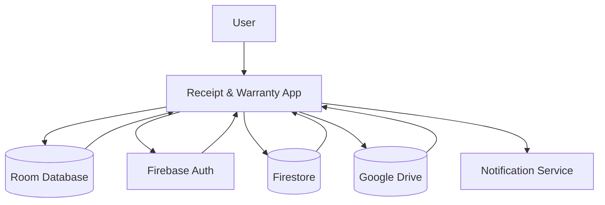

#### UML Class Diagram
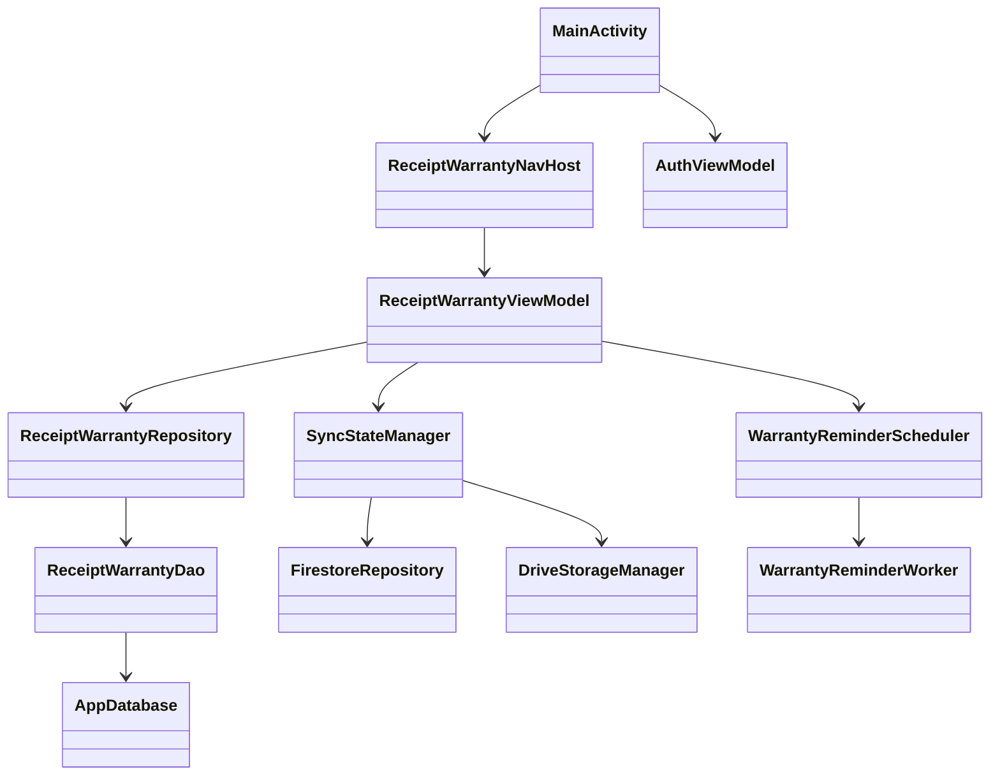

#### UML Sequence Diagram (Add Item + Sync)
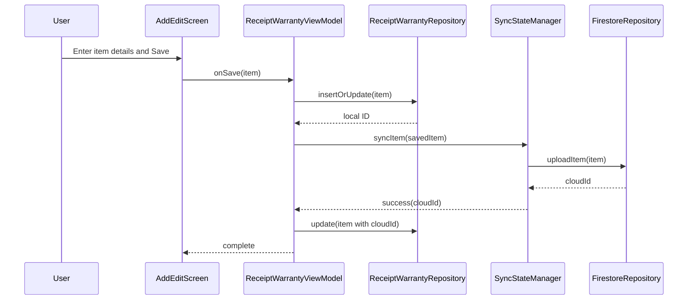

---

## Conclusion
The designed system provides a practical hybrid architecture: fast local operations with Room and cloud continuity with Firebase/Drive integration. It meets the core objective of receipt/warranty management while remaining extensible for future features like analytics, multi-platform clients, and richer reporting.
