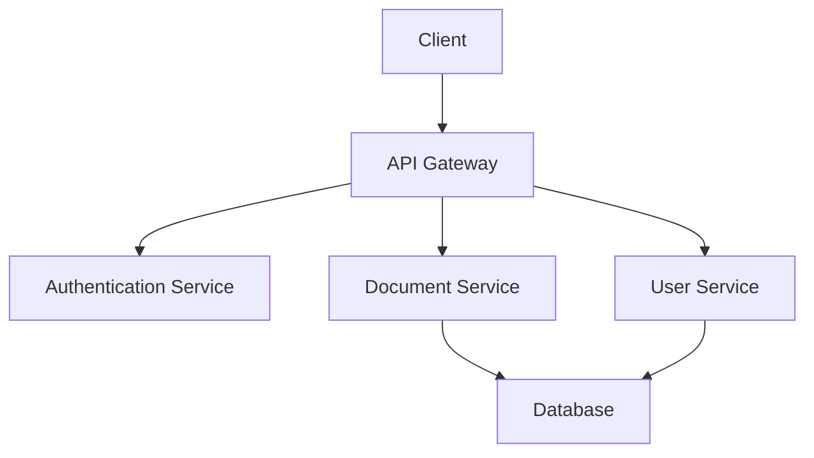
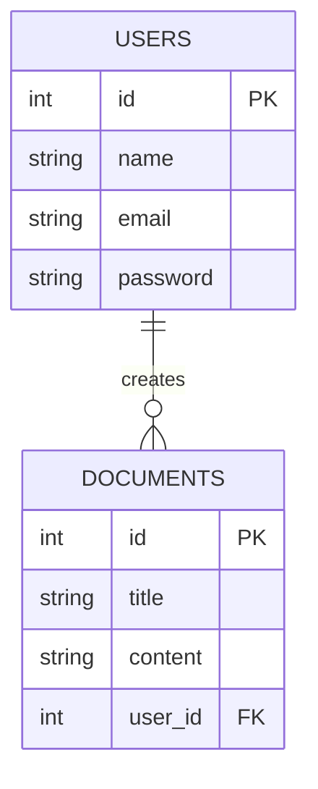
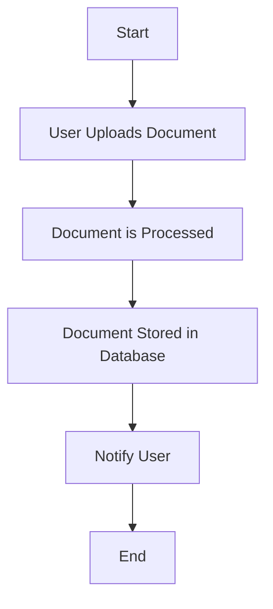
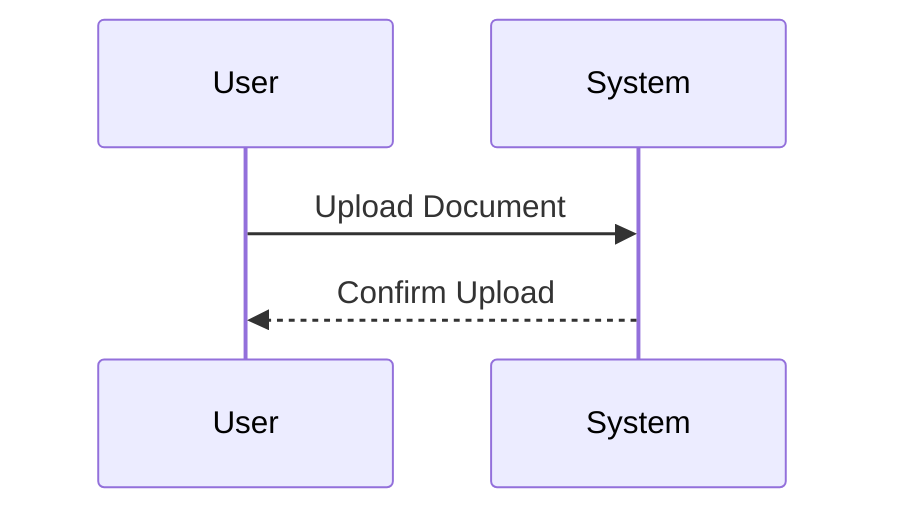

# Project Report for Vault Document Management Application

## Architecture Diagrams

```mermaid
graph TD;
    A[Client] --> B[API Gateway];
    B --> C[Authentication Service];
    B --> D[Document Service];
    B --> E[User Service];
    D --> F[Database];
    E --> F;
```

## Database Schema

```mermaid
erDiagram
    USERS {
        int id PK
        string name
        string email
        string password
    }

    DOCUMENTS {
        int id PK
        string title
        string content
        int user_id FK
    }

    USERS ||--o{ DOCUMENTS : creates
```

## Workflow Diagrams

```mermaid
flowchart TD
    A[Start] --> B[User Uploads Document]
    B --> C[Document is Processed]
    C --> D[Document Stored in Database]
    D --> E[Notify User]
    E --> F[End]
```

## Use Cases

```mermaid
%%{init: {'theme': 'default'}}%%
   sequenceDiagram
       participant User
       participant System
       User->>System: Upload Document
       System-->>User: Confirm Upload
```